SIMPIC - Simple 1D PIC prototype
================================

SIMPIC is extracted from [OOPD1]_ source code to demonstrate [StarPU]_
possibilities.


The code is a simple one-dimensional electrostatic code (meaning
:math:`\nabla\times\mathbf{B}=\partial\mathbf{B}/\partial t \approx 0`
so that :math:`\mathbf{E}=-\nabla\phi`), with self and applied
electric fields *E* directed along coordinate *x*. There are no
variations in *y* or *z* directions. The plane parallel problem
consists of single (electron) species.

Description of SIMPIC
~~~~~~~~~~~~~~~~~~~~~

Particle in cell (PIC) is a particle-mesh method. This means that the phase space distribution of particles :math:`f(v)`,
is represented by collocation of discrete computational particles, with each computational particle representing ``np2c``
real particles. Instead of computing the interactions between each particle, the particle density (and higher moments for some PIC methods) is interpolated (weighed) to the mesh. A field equation (Poisson’s equation) is solved using this information and the computed force is interpolated back to the particle which is used to update its velocity and position. This alternating field solve and particle push is repeated for each time step. For electrostatic PIC, Poisson’s equation is solved for potential and then numerically differentiated to determine the electric field.

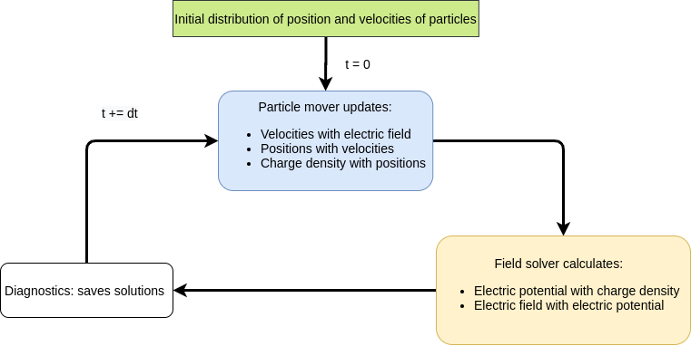

  SIMPIC workflow scheme functions.

Poisson solver
--------------

Poisson’s equation for electrostatics is applicable when the magnetic field is not present or not time varying
(magnetostatic). In this case, the electric field may be written as the gradient of a scalar potential field, :math:`\phi`:

.. math:: \mathbf{E}=-\nabla\phi 

Gauss’s law then becomes:

.. math:: \nabla\cdot(\epsilon\mathbf{E})=-\nabla\cdot(\epsilon\nabla\phi)=\rho

In this equation  :math:`\rho` is charge density, obtained from particle date (for a single species of particles, :math:`\rho=qn`,
where  :math:`q` is the charge per particle and  :math:`n` is the number density of the species).

For meshes with a uniform value of :math:`\epsilon`, the Laplacian operator may be used:

Cartesian:

.. math:: \nabla^2\phi=\frac{\mathrm{d^2}\phi}{\mathrm{d}x^2}

Cylindrical:

.. math:: \nabla^2\phi=\frac{1}{r}\frac{\mathrm{d}}{\mathrm{d}r}\left (r\frac{\mathrm{d}\phi}{\mathrm{d}r}\right ) = \frac{\mathrm{d^2}\phi}{\mathrm{d}r^2} + \frac{1}{r}\frac{\mathrm{d\phi}}{\mathrm{d}r}

Spherical:

.. math:: \nabla^2\phi=\frac{1}{r^2}\frac{\mathrm{d}}{\mathrm{d}r}\left (r^2\frac{\mathrm{d}\phi}{\mathrm{d}r}\right ) = \frac{1}{r}\frac{\mathrm{d^2}}{\mathrm{d}r^2}\left (r\phi \right ) = \frac{\mathrm{d^2}\phi}{\mathrm{d}r^2} + \frac{2}{r}\frac{\mathrm{d\phi}}{\mathrm{d}r}

In finite difference form for a uniform mesh:

Cartesian:

.. math:: \nabla^2\phi_i=\frac{\phi_{i-1}-2\phi_{i}+\phi_{i+1}}{\Delta x^2}+\mathcal{O}(\Delta x^2)

Cylindrical:

.. math:: \nabla^2\phi_i=\frac{\phi_{i-1}-2\phi_{i}+\phi_{i+1}}{\Delta r^2} + \frac{1}{r_i}\frac{\phi_{i+1}-\phi_{i-1}}{2\Delta r}+\mathcal{O}(\Delta r^2)

Spherical:

.. math:: \nabla^2\phi_i=\frac{\phi_{i-1}-2\phi_{i}+\phi_{i+1}}{\Delta r^2} + \frac{2}{r_i}\frac{\phi_{i+1}-\phi_{i-1}}{2\Delta r}+\mathcal{O}(\Delta r^2)

For a mesh with variable :math:`\epsilon`, the left hand side of Poisson’s equation is more complex:

.. math:: \nabla\cdot(\epsilon\nabla\phi)=-\rho

In one (radial) dimension, the gradient operator is of the same form regardless of coordinate system (Cartesian, cylindrical, spherical):

.. math:: -(E_x)=\nabla\phi\Rightarrow\frac{\mathrm{d}\phi}{\mathrm{d}x}=\frac{\phi_{i+1}-\phi_{i-1}}{2\Delta x}+\mathcal{O}(\Delta x^2)

For one-dimensional planar meshes with uniform permivity :math:`\epsilon_0`, as studied here, the solution to Poisson’s equation yields a tridiagonal matrix where the potential at node :math:`i` may be solved for in terms of nodes :math:`i+1` and :math:`i-1`:

.. math:: \phi_{i-1}-2\phi_{i}+\phi_{i+1}=-\frac{\rho_i(\Delta x)^2}{\epsilon_0}

:math:`\rho_i` is the charge density at node :math:`i` and is obtained from particle data. :math:`\Delta x` is the mesh spacing. Boundary conditions are needed to close the system at the mesh points. In this study, ideal conductors were used (Dirichlet boundary conditions).  ``oopd1`` deals with all three 1D coordinate systems as described above with constant and variable permitivity as well several different types of boundary conditions.

Particle Push
-------------

The coordinates, :math:`x`, and velocities, :math:`v`, of the particles are initially prescribed. If only the force due to the electric field is considered, the non-relativistic equations of motion for particle :math:`j` are:

.. math:: \frac{\mathrm{d}x_j}{\mathrm{d}t}=v_j

.. math:: \frac{\mathrm{d}v_j}{\mathrm{d}t}=\frac{qE(x_j)}{m}


:math:`x_j` and :math:`v_j` are the :math:`x`-coordinate and component
of velocity, respectively. :math:`q` and :math:`m` are the charge and mass of particle :math:`j` (respectively), and :math:`E(x_j)` is the :math:`x`-component of electric field at particle :math:`j`.

Linear interpolation is used to find the electric field at particle :math:`j` from the nodal values:

.. math:: E(x_j)=E_{i+1}\cdot\frac{x_j-x_i}{x_{i+1}-x_i}+E_i\cdot\left (1-\frac{x_j-x_i}{x_{i+1}-x_i} \right )

The particle is assumed to be located between node :math:`i` and :math:`i+1` in this equation.

A discrete scheme used in PIC to advance the equations of motion is as follows:

.. math:: v_{new}=v_{old}+\frac{qE}{m}\cdot\Delta t

.. math:: x_{new}=x_{old}+v_{new}\cdot\Delta t

:math:`\Delta t` is the time step used. If the position and velocity components are known at the same time, this is (forward) Euler’s method (1st order accurate). If the velocity is staggered half a time step with respect to position, this is the “leap-frog” (midpoint rule) method (2nd order accurate). The latter is acoomplished by initially advancing the velocity of all particles half a time step backwards using the initial field.

Once the new position of particle :math:`j` is known, its charge is weighed to the mesh using the inverse of the formula used to gather the electric field to the particle. The resulting charge density is then
used in the Poisson solve.

Accuracy Requirements for PIC
-----------------------------

The basic discretization parameters for (explicit) PIC are mesh spacing, time step, and the number of particles per cell. For electrostatic PIC, the mesh spacing, :math:`\Delta x`, and time step, :math:`\Delta t`, must be determined from Debye length, :math:`\lambda_D`, and the plasma frequency, :math:`\omega_P`, respectively, for accuracy and stability:

.. math:: \Delta x < \lambda_D=\left ( \frac{\epsilon_0 T}{en} \right )^{1/2}

.. math:: (\Delta t)^{-1}\gg\omega_P=\left ( \frac{e^2n}{\epsilon_0 m} \right )^{1/2}


In these equations, :math:`T` is the plasma temperature in volts, :math:`n` is the plasma density, :math:`\epsilon_0` is the permitivity of
free space, :math:`e` is the elementary charge, and :math:`m` is the mass of the lightest species.

Violation of these conditions will result in inaccurate and possibly unstable solutions. Typically, :math:`\Delta x\approx 0.5\lambda_D` and :math:`\Delta t\approx 0.1\omega_P^{-1}`.

Building
~~~~~~~~

MPI C++ compiler is required to build and run SIMPIC.

.. code-block:: bash

  git clone git@bitbucket.org:kosl/elmfireng.git
  cd elmfireng
  git fetch && git checkout feature/simpic
  cd simpic
  make
  make html
  xdg-open build/html/index.html

Running with MPI
~~~~~~~~~~~~~~~~

.. code-block:: bash

  ./runsimpic.sh 2> run.log
  mpirun -np 4 a.out -ppc 100 -ncpp 64 -nt 200 -dtfactor 0.001 -lhsv 25000
  rank 0 of 4 processors
  MPI version: 3.1, MPI_Wtime precision: 1e-09
  t=1.12e-09, dt=5.6e-12, ntimesteps=200, density=1e+13, wp=1.79e+08,
  np2c=3.91+08 6400 particles, ng=65, nc=64, L=1, Ll=0.25, dx=0.00390625,
  area=1

  Timings:
  Particles time: 0.111255 [5.0%]
  Fields time: 0.000620347 [0.0%]
  MPI time: 0.154564 [6.9%]
  Diagnostics time: 1.93947 [86.9%]
  Initialization time: 0.00460355 [0.2%]

  Total time: 2.23218 (2.21051 [99.0%])
  569640 (1.14291e+07) particles/second

Diagnostics
~~~~~~~~~~~

Change to `diagnosticsflag = true` in :file:`simpic.cpp` to get
diagnostic :file:`.dat` files of:

  - density
  - E electric field
  - phi potential
  - vxx (phase space)
  - nt is time evolution of number of particles per processor

File format for each processor is::

  time relative_position value

Defining `DEBUG` symbol in :file:`global.h` produces additional
prints to `stderr` stream.

.. note::

   Timings are not representative when defining `DEBUG` and
   `diagnosticsflag = true`.


Variables
~~~~~~~~~

.. code-block:: bash

 NT=200  # of time steps
 PPC=100 # of particles per cell
 CPP=64  # of cell per process
 DTFACTOR=0.001 #defines a fraction of dt vs. time steps from plasma frequency;
		#must be positive
 NPROC=4 # of processors
 LHSV=25000 #applied voltage on left-hand side; RHS is grounded;

`density = 1.E13`
  density of electrons (:math:`n`)
`epsilon = 8.85E-12`
  permitivity of free space (:math:`\epsilon_0`)
`nc`
  number of cells per processor (CPP=64)
`ng`
  number of gridpoints is always one more than number of cells. ng=nc+1
`npart`
  number of (super)particles per processor
  = number of cells * number of particles per cell
`L`
  total length of the system
`q`, `m`
  elementary charge and electron mass
`xl, xr`
  *x* position of left and right bounaries for each processor
`Ll`
  length of the system for each processor
`dx`
  length of each cell :math:`dx=Ll/nc`,
  where `nc` is number of cells per processor
`nl`
  rank of the processor on the left.
  Process 0 has last process on the left in a cyclic manner.
`nr`
  rank of the processor on the right.
  Last process has process 0 on the right in cyclic manner.
`nlp`
  number of `lhsbuf` values to be communicated to the left processor.
`nrp`
  number of `rhsbuf` values to be communicated to the right processor.
`np2c`
  number of (electron) particles per cell
  = density * volume of each processor covers/number of particles per processor
`wp`
  electron plasma frequency :math:`\omega_p^2 = \frac{n q^2}{\epsilon_0 m}`
`dtfactor=0.001`
  fraction of plasma frequency time :math:`\tau = 1/\omega_p` to be used as
`dt`
  time step :math:`\delta t=dtfactor\cdot\tau`
`pdata[2*nproc*npart]`
  phase-space data array of particle *x* positions and *v* velocities
  alternated. Index `j` is *x* position and `j+1` is velocity.
`lhsbuf[2*nproc*npart], rhsbuf[2*nproc*npart]`
  buffers of particle positions and velocities on the left and right.
`narray[ng]`
  density array
`phiarray[ng]`
  potential array
`Earray[ng]`
  Electric field array
`nback[ng]`
  not used. intert. backup.
`scale`
  generic scaling of differences equation that usually multiplies
  with :math:`1/\Delta x` or similar weighting.

Main loop
~~~~~~~~~

moveparticles(dt)
     Computes from the electric field *E* new velocity
     for each particle and moves it to new position. If the particles
     moves out of processor bounds [xl, xr] then it is moved to left
     or right hand side buffer for communication to neighboring
     processors.
communicateparticles()
     Each processor sends particles to the left and right. Before
     communition of arrays starts, sizes are exchanged.
advancefields(dt)
     Tridiagonal matrix of Poisson equation
     :math:`\phi_{j+1}-2\phi_j+\phi_{j-1}=p_j`
     is solved with Gaussian elimination  [BiLa85]_ by each processor
     and then fields are communicated to all processors. Then Laplace
     equation is summed to
     get the potential :math:`phi`-array. From :math:`\phi` negative gradient
     gives E-array.

CPU StarPU
==========

Converting MPI version of SimPIC to task based CPU version follows
StarPU guidelines for MPI support.

Integrating StarPU in a Make Build System
~~~~~~~~~~~~~~~~~~~~~~~~~~~~~~~~~~~~~~~~~~

We begin with adding StarPU MPI header to :file:`simpic.cpp`

.. code-block:: c++

    #include <starpu_mpi.h>

and modifying :file:`Makefile` for compiler and linking flags

.. code-block:: make

   CFLAGS += $$(pkg-config --cflags starpumpi-1.3)
   LDLIBS += $$(pkg-config --libs starpumpi-1.3)

   debug:
	mpic++ -g $(CFLAGS) simpic.cpp message.cpp $(LDLIBS)

Not using the StarPU MPI support
~~~~~~~~~~~~~~~~~~~~~~~~~~~~~~~~

For a start we can concentrate on the StarPU task breakdown, leaving
original MPI communication intact. StarPU data management with
Distributed Shared Memory (DSM) needs to be provided in a consistent
manner through the MSI protocol (Modified / Shared / Invalid).

Examining ``moveparticles(Scalar dt)`` as our first codelet the data
that is send over MPI in ``communicateparticles()`` is basically
received into complete ``pdata`` phase-space vector from buffers
``lhsbuf`` and ``rhsbuf`` that are practically sending smaller number
of particles to the lhs and rhs. Number of particles that left
computational domain ``[xl, xr]`` of each processor is counted by
``nlp`` and `nrp`. Particles move according to *E* field defined at
the grid points. Each processor is using ``ng`` grid points in
``Earray`` vector.

Parameters that do not change in communication within the codelet are
left ``nl`` and right ``nr`` neighboring processor numbers, domain
boundary ``[xl, xr]`` pair, time step size ``dt``, ``ng`` grid points,
and factors such as charge-mass ``qm`` and cell-size ``dx`` that are
pre-computed for faster computation in subroutines. All these trivial
parameters that are not handled by StarPU data management can be
passed to the codelet in one structure as a pointer to the structure
containing all codelet arguments.

.. highlight:: c++

So, instead of global variables ::

   int nl, nr;

we encapsulate them into ::

   struct cl_args_t {
     int nl, nr;
   };

and create an instance of the struct ::

   cl_args_t cl_args;

and replace ``nl`` with ``cl_args.nl`` and ``nr`` with ``cl_args.nr``
respectively everywhere in the code in order to compile. We gradually
add more parameters in step by step manner. For example we move ``dt``
into ::

   struct cl_args_t {
     Scalar dt;
     int nl, nr;
   };

In the end all the necessary parameters are put into the struct ::

   struct cl_args_t {
     Scalar qm;
     Scalar dt;
     Scalar dx;
     Scalar xl;
     Scalar xr;
     int nl, nr;
     int nlp, nrp;
   };

Besides replacing, i.e. ``nl`` to ``cl_args.nl``, we must also add the struct
as parameter, since it will not be global anymore.

Now we focus on function ``void moveparticles``. The initial signature takes
``Scalar dt`` as argument, but now we will change it to
``struct cl_args_t cl_args``

.. code-block:: diff

   - void moveparticles(Scalar dt)
   + void moveparticles(struct cl_args_t *cl_args)
     {
   +   struct cl_args_t *cl_args = (struct cl_args_t *) _cl_args;

The calling of this function inside ``mainloop(Scalar tmax, Scalar dt)`` is
changed

.. code-block:: diff

   - moveparticles(dt)
   + moveparticles(&cl_args)

Now, since the pointer is passed to the function, we need to change the access
to the variables inside the struct

.. code-block:: diff

   - cl_args.qm
   + cl_args->qm

.. note::

   The refactoring of ``cl_args`` should be complete in a way that it can
   be removed from global scope. For a start, when using CPU only codelet,
   all ``cl_args`` will be read-only and will not cause locking problems
   and transfers from main memory. When GPU codelet is introduced then
   ``cl_args``` needs to removed from global scope and pass its parameters
   to subroutines from the codelet.

We can now start creating StarPU task for the function ``movepartparticles``.
First we need a struct *starpu_codelet* that contains information on what
function to be called and if there are any buffers to send.

.. code-block:: cpp

   static struct starpu_codelet cl =
     {
       .cpu_funcs = { moveparticles },
       .cpu_funcs_name = { "moveparticles" },
       .nbuffers = 3, // Number of buffers (arrays) the function needs
       .modes = {STARPU_RW, STARPU_RW, STARPU_RW} // Read/Write modes for buffers
     }

Now we can create a task

In ``global.h``  we define a global task

.. code-block:: cpp

   struct starpu_task *task;

In ``simpic.cpp``:

.. code-block:: cpp

   task = starpu_tash_create();
   task->cl = &cl;
   task->handles[0] = pdata_handle;
   task->handles[1] = lhsbuf_handle;
   task->handles[2] = rhsbuf_handle;
   task->cl_arg = &cl_args; // Struct containing constants
   task->cl_arg_size = sizeof(cl_args_t);
   task->synchronous = 1; // Blocking task
   task->destroy = 0; // Do not destroy the task after submitting because it is a repeatable one.

Before we submit the task we have to fix the signature of ``moveparticles``

.. code-block:: diff

   - void moveparticles(struct cl_args_t *cl_args)
   +
   + void moveparticles(void *buffers[], void * _cl_args)
     {
      int i, j;
      Scalar E, x, v;
      struct cl_args_t *cl_args = (struct cl_args_t *) _cl_args;

   +  Scalar *pdata = (Scalar *) STARPU_VECTOR_GET_PTR(buffers[0]);
   +  Scalar *lhsbuf = (Scalar *) STARPU_VECTOR_GET_PTR(buffers[1]);
   +  Scalar *rhsbuf = (Scalar *) STARPU_VECTOR_GET_PTR(buffers[2]);


The argument signature ``void *buffers[], void * _cl_args`` is default for all
StarPU CPU task functions. To get a vector buffer you call
``STARPU_VECTOR_GET_PTR`` on the input argument buffers[n], where n is is the
chosen before hand when defining a StarPU task.

Now we can submit the task inside the function ``mainloop``

.. code-block:: diff

   - moveparticles(&cl_args);
   + starpu_task_submit(task);

GPU CUDA
========

The CUDA version of SimPIC is basically the MPI version with some CPU functions refactored to GPU CUDA functions. The code was tested only for ``-np=1``, i.e., only for MPI execution with one process.

Compiling options and Make Build System
~~~~~~~~~~~~~~~~~~~~~~~~~~~~~~~~~~~~~~~~~~

The CUDA code must reside in files with the :file:`.cu` extension, otherwise the code is compiled as normal C/C++ code by the ``nvcc`` compiler. For example, for some CUDA code in :file:`simpic.cu` the SimPIC code can be build with the following :file:`Makefile`: 

.. code-block:: make

   CFLAGS ?= -lmpi -lcusparse

   all: 
	nvcc simpic.cu message.cpp $(CFLAGS)

   debug: 
	nvcc simpic.cu message.cpp $(CFLAGS)

   clean:
	rm -f a.out *.o *.dat


GPU particle mover + field solver
~~~~~~~~~~~~~~~~~~~~~~~~~~~~~~~~~

In this documentation we are going to explain how we moved the SIMPIC
Particle Mover and Field Solver to GPU. This will be a detailed
description but we will avoid physics, discretization models and some
CPU functions that were already in the CPU code to avoid an extremely
large document.


First of all, we will see how is the structure of the code. The
following table contains all the files that are contained in the SIMPIC
GPU version folder.

.. table:: Files in the GPU version of particle mover and field solver.

   +-----------------------+------------------------------------+--------------------------------------------+
   | File                  |  Includes                          |  Description                               |
   +=======================+====================================+============================================+
   | ``simpic.cu``         | CUDA, standard and mpi libraries   | Here is located Particle Mover in GPU.     |
   +-----------------------+------------------------------------+--------------------------------------------+
   | ``fields.cu``         | CUDA libraries, cuSPARSE libraries | Contains Field Solver algorithms. in GPU.  |
   +-----------------------+------------------------------------+--------------------------------------------+
   | ``global.h``          | None                               | SIMPIC global definitions.                 |
   +-----------------------+------------------------------------+--------------------------------------------+
   | ``diagnostics.cpp``   | None                               | file in the mainloop of the program.       |
   +-----------------------+------------------------------------+--------------------------------------------+
   | ``timing.cpp``        | None                               | MPI tools for timing                       |
   +-----------------------+------------------------------------+--------------------------------------------+
   | ``ostring.hpp``       | Standard libraries                 |                                            |
   +-----------------------+------------------------------------+--------------------------------------------+
   | ``dat_to_gnuplot.py`` | None                               | Python script to convert outputs.          |
   +-----------------------+------------------------------------+--------------------------------------------+
   | ``Makefile``          | None                               | Compiling instructions                     |
   +-----------------------+------------------------------------+--------------------------------------------+
   | ``runsimpic.sh``      | None                               | Run in command line: ``./runsimpic.sh``    |
   +-----------------------+------------------------------------+--------------------------------------------+

To accelerate the code we had to move ``simpic.cpp`` and ``fields.cpp``
to GPU. That was done, at the beginning, changing the extension to a CUDA
file ``.cu``. Also, we can see that files ``trimatrix.cpp``,
``trimatrix.hpp`` and ``functions.hpp`` were removed. Those files were
interfering in the GPU parallelization so the features that we needed
from them were included in the CUDA files.

In summary, the main files that we have to focus on are ``simpic.cu``,
``fields.cu`` and ``global.h``. The rest of the files have minor changes
or were unaltered. In figure `1 <#fig:flowchart>`__ we can see the
execution order for all the main files and we are highlighting where are
those functions located and how are they executed (in CPU or GPU).

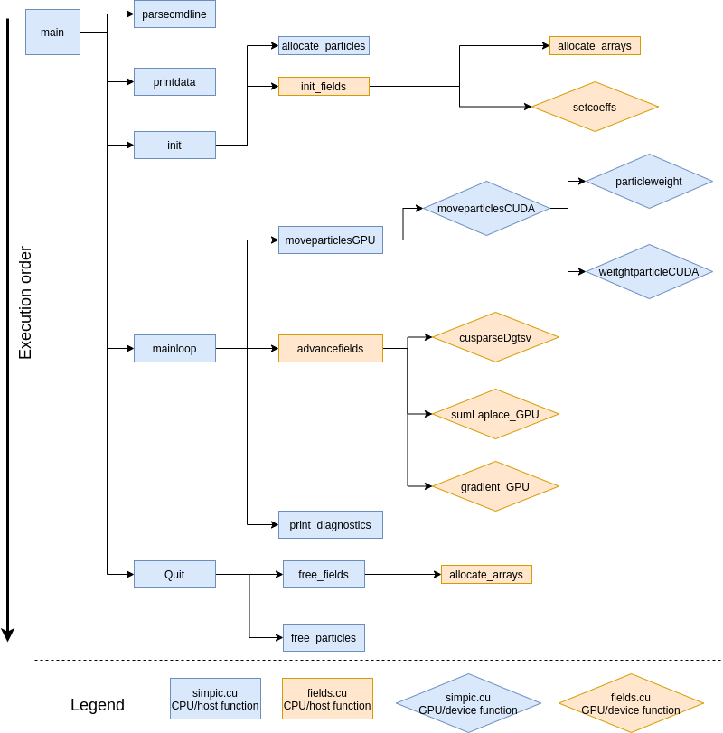

   SIMPIC execution order in the main files. Shows GPU and CPU functions.


In this section we are going to explain the main changes in the files
``global.h``, ``fields.cu`` and ``simpic.cu`` and how CPU calculations
were moved to GPU. The main idea of parallelizing in GPU is that each
GPU thread will perform an operation. In our case, for particle mover,
each thread is going to compute operations for one particle and, for
field solver, each thread will calculate values for one grid point. In
this process, it is important to track the number of threads and blocks
to be used as well as all the data copies from CPU to GPU and vice versa.
Also, we have to initialise and take into account many handles, status
and pointers to GPU features.

In the following subsections we will look at the definitions and aspects
to perform a correct GPU parallelization of the original CPU code. For a
complete understanding, we will start with the general definitions,
after so we will see how the field solver GPU parallelization was made
and finally the main program and particle mover GPU paralellization.

Initial changes (``global.h``)
------------------------------

Some initial definitions are required for the development of this code.
This definitions are implemented in ``global.h``. First of all, we need
to define the data types that we are going to use. CUDA does not
understand Scalar data types, so we move the main arrays to doubles:

.. code:: c++

   //Particle mover arrays
   double *pdata;
   double *pdata_gpu;
   bool *check_alive;
   int npart;

   // field arrays
   double *Earray;
   double *phiarray;
   double *narray;
   double *nback;
   double *Earray_gpu;
   double *narray_gpu;
   double *d_a,*d_b,*d_c,*d_r;
   int *nc_gpu;

   //GPU values
   int Nthreads_max;
   int Nblocks_particles;
   int Nblocks_fields;

   cudaDeviceProp prop;

It is important to note that we have defined twice ``pdata`` (particle
array with position and velocity for each particle), ``Earray`` (array
of electric field values) and ``narray`` (density array). This is
because we need a different data allocation in CPU and GPU. Initially,
we should need a copy of ``phiarray`` in GPU but our version of the
field solver does not need so (we will see why). Also we define the a
CUDA structure ``cudaDeviceProp`` which will give us the information
about our GPU device.

Also, we need a very important function called
`atomicAdd <https://docs.nvidia.com/cuda/cuda-c-programming-guide/index.html#atomic-functions>`__.
This function allows every GPU thread to read a value at some address of
global or shared memory, add it a value and write the result back to
that address. So many threads can add a value to a certain pointer. This
functions works for float data types in every GPU structure but it only
computes double operations for CUDA architectures greater or equal than
600. So we have to implement an atomicAdd function for doubles that
operates in every CUDA architecture. We do this with:

.. code:: c++

   __device__ double atomicAdd_double(double* address, double val)
   {
       unsigned long long int* address_as_ull =
                                 (unsigned long long int*)address;
       unsigned long long int old = *address_as_ull, assumed;

       do {
           assumed = old;
           old = atomicCAS(address_as_ull, assumed,
                           __double_as_longlong(val +
                                  __longlong_as_double(assumed)));

       // Note: uses integer comparison to avoid hang in case of NaN (since NaN != NaN)
       } while (assumed != old);

       return __longlong_as_double(old);
   }

With all this previous definitions we can move on the main structure of
the code.

Field solver (``fields.cu``)
----------------------------

The field solver is aimed to calculate the electric field over the
simulated space. The main difference with the particle mover is that we
need a discretization of the spatial domain in a finite number of
points, called grid points, where the electrostatic equations will be
solved.

We will write the GPU version in the file ``fields.cu`` which has the
extension ``.cu`` from CUDA. The original field solver script was
written in ``fields.cpp``.

First of all, we import the needed modules in the script:

.. code:: c++

   #include <iostream>
   #include <cuda.h>
   #include<cuda_runtime.h>            
   #include<cusparse_v2.h> 

We are including the basic CUDA libraries. ``cuda.h`` defines the public
host functions and types for the CUDA driver API, ``cuda_runtime.h``
defines the public host functions and types for the CUDA runtime API as
well as built-in type definitions and function overlays for the CUDA
language extensions and device intrinsic functions, `click here for more
info <https://stackoverflow.com/questions/6302695/difference-between-cuda-h-cuda-runtime-h-cuda-runtime-api-h>`__,
and ``cusparse_v2.h`` is a CUDA library which contains algebraic
routines for sparse matrices which will be useful at some point of the
script, you can find more information in
`cuSPARSE <https://docs.nvidia.com/cuda/cusparse/index.html>`__.

Now we define a status and a handle for the cuSPARSE library:

.. code:: c++

   cusparseStatus_t status;
   cusparseHandle_t handle=0;

``cusparseStatus_t`` is a data type that represents the status returned
by the cuSPARSE library and ``cusparseHandle_t`` is a pointer to an
opaque cuSPARSE context and will be initialized later before calling any
function from this library. More about this data types can be found in
the `cuSPARSE
documentation <https://docs.nvidia.com/cuda/cusparse/index.html#cusparse-types-reference>`__.

After so, we have to initialise or allocate the arrays:

.. code:: c++

   /*Array allocation in CPU and GPU*/
   void allocate_arrays(int dealloc=0)
   {
     if(dealloc)
       {
         /*Delete CPU arrays*/
         delete [] narray;
         delete [] phiarray;
         delete [] Earray;
         
         /*Free GPU memory*/
         cudaFree(Earray_gpu);
         cudaFree(narray_gpu);
         cudaFree(nc_gpu);
         cudaFree(d_a);
         cudaFree(d_b);
         cudaFree(d_c);
         return;
       }
     
     /*Allocate GPU matrix arrays*/ 
     cudaMalloc((void**)&Earray_gpu, ng*sizeof(double));
     cudaMalloc((void**)&narray_gpu, ng*sizeof(double));
     cudaMalloc((void**)&nc_gpu, sizeof(int));
     cudaMalloc((void **)&d_a, ng*sizeof(double));
     cudaMalloc((void **)&d_b, ng*sizeof(double));
     cudaMalloc((void **)&d_c, ng*sizeof(double));
     
     /*Create CPU arrays*/  
     narray = new double[ng];
     phiarray = new double[ng];
     Earray = new double[ng];
   }

This function creates the CPU arrays and allocates memory in GPU for the
arrays or values with the already defined data types. The function
`cudaMalloc <http://developer.download.nvidia.com/compute/cuda/2_3/toolkit/docs/online/group__CUDART__MEMORY_gc63ffd93e344b939d6399199d8b12fef.html>`__
does this job, which takes to arguments, the first one is a pointer to
the allocated memory and the second one is the requested allocation size
in bytes. We also have provided this function with a deallocation
feature using
`cudaFree <https://docs.nvidia.com/cuda/cuda-runtime-api/group__CUDART__MEMORY.html#group__CUDART__MEMORY_1ga042655cbbf3408f01061652a075e094>`__
to liberate data from GPU at the end of the run.

We need to define the matrix coefficients for the given discrete scheme.
This will be done in the first CUDA kernel:

.. code:: c++

   /*Sets the matrix coefficients in each thread*/
   __global__ void setcoeffs(Scalar scale, double *a,double *b,double *c, int *nc_gpu)
   {
     /*the id of the thread*/
     int tid=blockIdx.x*blockDim.x+threadIdx.x;           

     /*Each thread writes three values depending on its tid.
      a is lower diagonal, b diagonal, c upper diagonal*/
     if(tid == 0 )
     {
         a[tid] = 0.0;
         b[tid] = 1.0;
         c[tid] = 0.0;
       }
     else if (tid == *nc_gpu)
     {
         a[tid] = 0.0;
         b[tid] = 1.0;
         c[tid] = 0.0;
     } 
     else if( (tid>0)&&(tid<*nc_gpu))
     {
         a[tid] = scale;
         b[tid] = -2.*scale;
         c[tid] = scale;
     }
   }

This simple function will help us to explain how a CUDA kernel works.
First of all, we see ``__global__`` preceding the definition of the
function. This prefix defines the function as a CUDA kernel which we will
call from the host (CPU) side using special semantics (we will see how).
Kernel functions are only executable in the device (GPU). We can also
use the prefix ``__device__`` to declare a device function which can
only be called by other device or global functions but never from host.

GPUs have many processors and each one has many threads. `In CUDA we say
that threads are distributed in
blocks <https://docs.nvidia.com/cuda/cuda-c-programming-guide/index.html#programming-model>`__.
Many threads in many blocks will execute this kernel, so this function
calculates the unique id of each thread ``tid`` and will fill the arrays
values (associated with the tridiagonal matrix) according to this id. So,
for example, if we have only 1 block and 1024 threads for 1000 grid
points, the thread 567 will modify the a, b and c values at the position
567 while the thread 1001 will do nothing.

With all this functions, we will call the initialization of the fields
from ``simpic.cu`` this is done by the following function

.. code:: c++

   /*Initialization of all variables and arrays*/
   void init_fields()
   {
     /*Array allocation*/
     allocate_arrays();
     
     /*Setting initial values*/
     cudaMemcpy(nc_gpu, &nc, sizeof(int), cudaMemcpyHostToDevice);
     cudaMemset(Earray_gpu, 0, ng*sizeof(double));
     
     /*Definition of GPU threads and blocks for the correct
      behaviour of the field solver. Nthreads_fields may vary 
      with hardware*/
     Nblocks_fields = ng/Nthreads_max +1;
     /*Set matrix coefficients*/
     setcoeffs<<<Nblocks_fields,Nthreads_max>>>(-epsilon/(q*dx*dx), d_a, d_b, d_c, nc_gpu);

     /*Create a cuSPARSE handle. Needed to call sparse functions*/
     status=cusparseCreate(&handle);
   }

In this function host function we allocate the arrays in CPU and GPU,
then we copy the value of the number of cells to GPU using
`cudaMemcpy <https://docs.nvidia.com/cuda/cuda-runtime-api/group__CUDART__MEMORY.html#group__CUDART__MEMORY_1gc263dbe6574220cc776b45438fc351e8>`__
and set the electric field values to 0 with
`cudaMemset <https://docs.nvidia.com/cuda/cuda-runtime-api/group__CUDART__MEMORY.html#group__CUDART__MEMORY_1gf7338650f7683c51ee26aadc6973c63a>`__.
After so we define the number of blocks which will execute the global
functions in the device. The number of threads is limited to a value
(usually 1024) and depends on the hardware, this value will be
initialised in ``simpic.cu``.

After initialising and declaring values, we have the first summon of a
function into GPU. We invoke the ``setcoeffs`` with special semantics,
we declare the blocks and threads from GPU which will execute the
function with ``<<<blocks, threads>>>`` and after so we pass the
function arguments between parenthesis as usual.

Finally, we create the status with
`cusparseCreate() <https://docs.nvidia.com/cuda/cusparse/index.html#cusparseCreate>`__
which initializes the cuSPARSE library and creates a handle on the
cuSPARSE context.

We also move the sum of the Laplace solution and the gradient
calculation to GPU with the global functions:

.. code:: c++

   /*Sums the Laplace equation for rhs and lhs voltages*/
   __global__ void sumLaplace_GPU(double *pphh, Scalar dx, Scalar rv, Scalar lv, Scalar xl, Scalar L, int ng)
   {
     int tid=blockIdx.x*blockDim.x+threadIdx.x;           
     Scalar frac, xlocal;

     if( (tid >= 0) && ( tid < ng)){
       xlocal = xl + tid*dx;
       frac = xlocal/L;
       pphh[tid] += (frac*rv + (1. - frac)*lv) ;
   }

   /*Computes the gradient in GPU*/
   __global__ void gradient_GPU(double *grad, double *arr, int n, Scalar scale)
   {
     int tid=blockIdx.x*blockDim.x+threadIdx.x;           

     /*Intermediate points calculation*/
     if( (tid>0) && (tid < n))
     {
         grad[tid] = scale*(arr[tid+1] - arr[tid-1]);
     }
     
     /*Fix up end points*/
     if(tid==0)
     {
       grad[0] = 2*scale*(arr[1] - arr[0]);
     }
     if(tid==n)
     {
       grad[n] = 2*scale*(arr[n] - arr[n-1]);
     }
   }

At the end, we have the main function which will calculate the evolution
of the potential and field at a given time. This is a host function that
will call the already defined global functions to be executed in the
device.

.. code:: c++

   /*Updates phi and E values in dt*/
   void advancefields(Scalar ddt)
   {
     starttime(FIELDS);

     /*Correct density array for computation*/
     starttime(MEMORY_GPU);
     cudaMemset(&(narray_gpu[0]), 0, sizeof(double)); 
     cudaMemset(&(narray_gpu[nc]), 0, sizeof(double)); 
     endtime(MEMORY_GPU);

     starttime(PERFORMANCE);
     /*Trimatrix solver
      *Function from cuSPARSE for trimatrix solution*
      *Overwrites n_array with phi values*/
     status=cusparseDgtsv(handle,nc,1,d_a,d_b,d_c,narray_gpu,nc);
     if (status != CUSPARSE_STATUS_SUCCESS)
     {
        std::cout << status << std::endl;
     }  
     endtime(PERFORMANCE);

     /*Laplace correction and gradient calculation with values
      * that are already in GPU*/
     sumLaplace_GPU<<<Nblocks_fields,Nthreads_max>>>(narray_gpu, dx, rhsV(t), lhsV(t), xl, L, ng);
     gradient_GPU<<<Nblocks_fields,Nthreads_max>>>( Earray_gpu,  narray_gpu,  nc,  -0.5/dx);
     
     /*Copy data back to CPU*/
     if(diag_flag){
       starttime(MEMORY_GPU);
       cudaMemcpy(phiarray, narray_gpu, ng*sizeof(double),cudaMemcpyDeviceToHost);
       cudaMemcpy(Earray, Earray_gpu,ng*sizeof(double),cudaMemcpyDeviceToHost);
       endtime(MEMORY_GPU);
     }
     
     endtime(FIELDS);
   }

At this point, we understand almost everything happening in this
function. This is a host function that will set values to GPU, invoke
global functions in the GPU and copy back data from it. The only new
tool here is
`cusparseDgtsv() <https://docs.nvidia.com/cuda/cusparse/index.html#gtsv>`__
which is a cuSPARSE function for solving double tridiagonal matrices in
GPU. With this function, we do not need to search and implement an
algorithm for this calculation in GPU, because cuSPARSE already provides
it. There are many types of function for this kind of purposes in this
library, so you need to perform any basic algebra operation, it is
always a good idea to check in the cuSPARSE library documentation for
it.

CUDA Particle Mover
-------------------

In the MPI version the particles subjected to the electric field are moved by the moveparticles function, which is replaced by moveparticlesGPU in the CUDA version.

We created a boolean array ``check-alive`` to flag particles dead when they go out of bound and alive otherwise. This has been defined in the ``global.h`` file as:

.. code:: c++

   bool *check_alive;

This array needs to be allocated and initialized only inside the GPU, as it is not required by any of the CPU functions. This is done in the ``allocate-particles`` function in the ``simpic.cu`` file.

.. code:: c++

    CUDA_ERROR(cudaMalloc((void**)&check_alive,(nproc+1)*npart*sizeof(bool)));
    CUDA_ERROR(cudaMemset(check_alive,1,(nproc+1)*npart*sizeof(bool)));

All the particles are initially set to 1(alive). We now use this flag as an indicator of whether the particle positions/velocities need to be updated. This simplifies our   algorithm for out of bound particles. If the particles goes beyond the boundaries, then the particle can simply be flagged as dead.

The kernel in CUDA is a special function defined by the ``__global__`` prefix type. It executes blocks of threads in parallel, e.g., the kernel ``moveparticlesCUDA`` calculates the velocity ``pdata[index+1]`` and new position ``pdata[index]`` of every particle in parallel by executing every thread j which amounts to the number of particles npart in the simulation. It also calculates the array ``narray``. Since this array is read and written to by many threads in parallel, a so called "race condition" occurs. To avoid this condition CUDA atomic functions such as ``atomicAdd_double`` as defined before are used. These functions are blocking in nature and hence can have an effect on the performance. The CUDA kernel is executed only for particles that are alive.

.. code:: c++

    if(j<npart && alive[j]==true)  //kernel executed only if particle is alive
       {
         int index = 2*j;
         E = particleweight(pdata[index],Earray,xl,dx);
         pdata[index+1] += qm*E;
         pdata[index] += pdata[index+1]*dt;

         if(pdata[index]>xl && pdata[index]<xr)
         {
           weightparticleCUDA(pdata[index],qscale,narray,xl,dx);
         }
         else
         {
          alive[j]=false;  //out of bound particles flagged dead
        } 

Particles are created **in the GPU** and transferred to CPU **only** when diagnostics are called. This can be seen in the ``allocate-particles`` function in ``simpic.cu`` file.

.. code:: c++

           CUDA_ERROR(cudaMalloc((void**)&pdata_gpu,(nproc+1)*2*npart*sizeof(double)));
           ...
           for(int i=0, j=0; i < npart; i++, j+=2)
          {
            pdata[j] = xl + ((i + 1)*(xr-xl))/Scalar(npart + 1);
            pdata[j+1] = 0.;
          }

        CUDA_ERROR(cudaMemcpy(pdata_gpu, pdata, (nproc+1)*2*npart*sizeof(double), cudaMemcpyHostToDevice));

The allocation of GPU memory is done only once and the initialization is done in the CPU before being transferred to the GPU only **once** before the iteration main loop. The GPU works only on the particle array present in the device. The CPU does not have a copy of the updated velocities/positions, except when diagnostics is called.

Now only the field and density arrays need to be transferred each time, because these are updated by the CPU field solver each time. This can be seen in the ``moveparticlesGPU`` function in ``simpic.cu`` file.

.. code:: c++

 //CPU-GPU transfers, only E array
           CUDA_ERROR(cudaMemcpy(Earray_gpu, Earray, ng*sizeof(double),cudaMemcpyHostToDevice));
        CUDA_ERROR(cudaMemset(narray_gpu,0,ng*sizeof(double)));
       
        int threadsPerBlock = 256;
        int blocksPerGrid = (npart + threadsPerBlock - 1)/threadsPerBlock;
        moveparticlesCUDA<<<blocksPerGrid,threadsPerBlock>>>(pdata_gpu,check_alive,Earray_gpu,narray_gpu,xl,xr,dx,dt,qm,qscale,npart);
      //Only density array transferred GPU-CPU
        CUDA_ERROR(cudaMemcpy(narray,narray_gpu,ng*sizeof(double),cudaMemcpyDeviceToHost));

The field/density arrays are generally 2-3 magnitudes smaller than the particle arrays and hence, this data transfer would take negligible time.

However, the CPU requires this data to perform diagnostics and file I/O operations. To minimize this as much as possible I have set a diagnostics flag in the ``mainloop`` function in ``simpic.cu`` file.

.. code:: c++

    int diagnostics_counter = 0;

This counter can be set to a non-zero value to ask the CPU to perform diagnostics.

.. code:: c++

    if(diagnosticsflag)
    {
        CUDA_ERROR(cudaMemcpy(pdata, pdata_gpu, (nproc+1)*2*npart*sizeof(double),cudaMemcpyDeviceToHost));
        char msg[] = "";
        starttime(DIAGNOSTICS);
        print_diagnostics(msg);
        endtime(DIAGNOSTICS);
    }

You can set the counter to a non-zero value every certain number of time step iterations. And only then will the particle data be transferred to the CPU.

Some helper CUDA functions (the equivalent of the CPU helper functions) were defined (``__device__`` prefix type) which are used by the kernel. A few variables allocated statically (``__device__`` prefix type) were also defined and are also used by the kernel.

.. code:: c++

   /*Extrapolates values from particles to grid points.
    * Used to calculate density at the grid points*/
   __device__ void weightparticleCUDA(double x, double weight, double *array, double xl, double dx)
   {
     int n;
     float frac, xx;

     xx = (x-xl)/dx;
     n = int(xx);
     frac = xx-n;
     
     atomicAdd_double(&(array[n]),weight*(1.0 - frac));
     atomicAdd_double(&(array[n+1]),weight*frac);
   }

   /*Interpolates values for particle between two grid points.
    * Used to compute E field in particle position*/
   __host__ __device__ double particleweight(double x, double *array, double xl, double dx, int nc)
   {
     int n;
     double frac, xx;

     xx = (x-xl)/dx;
     n = int(xx);
     frac = xx-n;

     return frac*array[n+1] + (1.0 - frac)*array[n];
   }

Main Loop (``simpic.cu``)
--------------------------------------------

Now we are going to approach the main part of the code. This is located
in ``simpic.cu`` as it was in the CPU file ``simpic.cpp``. As always, we
start including the libraries and files we need:

.. code:: c++

   #include <stdio.h>
   #include <stdlib.h>
   #include <math.h>
   #include <string.h>
   #include <stdarg.h>


   #include "global.h"
   #include <mpi.h>
   #include "timing.cpp"
   #include "diagnostics.cpp"
   #include "fields.cu"

   #include <cuda.h>
   #include <cuda_runtime.h>
   #include <device_launch_parameters.h>

We have included some standard libraries, the rest of the files needed
for the simuation and CUDA libraries. The only new CUDA library (which
was not in ``fields.cu``) is ``device_launch_parameters.h`` which
provides us with some functions to get the information of the threads
such as ``threadIdx``.

Finally, we have the main SIMPIC functions:

.. code:: c++

   void mainloop(Scalar tmax, Scalar dt)
   {
     tt = 0.;
     int nsteps = 0;
     while(tt < tmax)
       {
         #ifdef DEBUG
         fprintf(stderr, "Completed %g %: t=%g, npart=%d \n", 
              float(nsteps)/(float(ntimesteps))*100.,tt, npart);
         #endif
         
         nsteps+=1;
         nparttot += npart;
         diag_flag = ((nsteps % dg_steps == 0)|| (nsteps == ntimesteps-1));
         /*Recalculate particle positions, velocity and density*/
         moveparticlesGPU(dt);    

         /*With new density recalculate E field*/
         advancefields(dt);

         /*Save diagnostics each dg_steps*/
         if( diag_flag )
         {
         starttime(DIAGNOSTICS);
         char msg[] = "";
         print_diagnostics(msg);
         endtime(DIAGNOSTICS);
         }

         tt += dt;
       }
   }

   int main(int argc, char **argv)
   {
     /*Get CUDA info*/
     CUDA_ERROR(cudaGetDeviceProperties(&prop,0));
     printf("Found GPU '%s' with %g Gb of global memory, max %d threads per block, and %d multiprocessors\n", prop.name, prop.totalGlobalMem/(1024.0*1024.0), prop.maxThreadsPerBlock, prop.multiProcessorCount);
     Nthreads_max = prop.maxThreadsPerBlock;  //Max threads to be used
     CUDA_ERROR(cudaSetDevice(0));     //Set the CUDA device

     //Init MPI
     MPI_Init(&argc, &argv);
     tstart = MPI_Wtime();

     starttime(INIT);
     parsecmdline(argc, argv);     //Get input data

     init();   //Initialise

     #ifdef DEBUG
       printdata();
       std::cout<<"Max GPU threads per block "<<Nthreads_max;
       std::cout<<", using "<< Nblocks_particles<<" blocks for particles and ";
       std::cout<<Nblocks_fields<< " blocks for fields \n";
       std::cout<<"At least 1 thread is per particle is needed and 1 thread per grid point \n";
     #endif
     endtime(INIT);
     
     mainloop(t, dt);

     tend = MPI_Wtime();

     printtimes(stdout);

     Quit();

     return 0;
   }

``mainloop`` works exactly the same as in the CPU version and its easier
to read due to the removal of MPI parallelization. At last, we have the
``main`` function, it is also a very straight forward function. We have
to comment that we call a very useful CUDA function called
`cudaGetDeviceProperties <https://docs.nvidia.com/cuda/cuda-runtime-api/group__CUDART__DEVICE.html#group__CUDART__DEVICE_1g1bf9d625a931d657e08db2b4391170f0>`__,
this functions returns an structure ``cudaDeviceProp`` that contains
relevant information about the avalaible GPU such as the maximum threads
per block and total global memory. We also have to call the function
``cudaSetDevice`` to set the device on which the active host thread
should execute the device code.

And that was the way to paralellize and understand the CUDA
implementation. We can see that it is not a hard work but it takes a lot
of time debugging and depuration of the code to make it able and
efficient to go.

StarPU notes
============

Building on VIZ
~~~~~~~~~~~~~~~~~

Before you can run the StarPU version of the code, you need to install
the StarPU directory in your working directory as mentioned before.

.. code-block:: bash

   wget https://files.inria.fr/starpu/starpu-1.3.4/starpu-1.3.4.tar.gz
   tar xvf starpu-1.3.4.tar.gz
   cd starpu-1.3.4
   mkdir build
   cd build
   ../configure --prefix=$HOME/starpu
   make
   make install

Building on taito-gpu cluster
~~~~~~~~~~~~~~~~~~~~~~~~~~~~~

.. code-block:: bash

   wget http://starpu.gforge.inria.fr/testing/starpu-1.3/starpu-nightly-latest.tar.gz
   tar xvf starpu-nightly-latest.tar.gz
   cd starpu-1.3.1.99/
   mkdir build
   cd build
   ../configure --prefix=$HOME/starpu --without-hwloc

Building on Bison GPU node
~~~~~~~~~~~~~~~~~~~~~~~~~~


.. code-block:: bash

    wget http://starpu.gforge.inria.fr/testing/starpu-1.3/starpu-nightly-latest.tar.gz

    # Other releases are available on http://starpu.gforge.inria.fr/files/
    # Stable release can be used instead:
    # wget http://starpu.gforge.inria.fr/files/starpu-1.3.3/starpu-1.3.3.tar.gz

    tar xvf starpu-nightly-latest.tar.gz
    mkdir starpu-1.3.3.99/build

    cd starpu-1.3.3.99/build
    module load cuda-10.1.243-gcc-8.3.0-qpdenfa
    ../configure --prefix=${HOME}/starpu --enable-openmp --enable-mpi-check
    make -j 8
    make install

Building on D.A.V.I.D.E. cluster
~~~~~~~~~~~~~~~~~~~~~~~~~~~~~~~~

On [DAVIDE]_ cluster the following build procedure is recommended.
One needs to configure [StarPU]_ on compute node and then compile the
library on the login node due to missing *Mellanox Hierarchical
Collectives* (hcoll) and *Mellanox Messaging* (mxm) libraries on
compute nodes.

.. code-block:: bash

    wget http://starpu.gforge.inria.fr/testing/starpu-1.3/starpu-nightly-latest.tar.gz
    tar xvf starpu-nightly-latest.tar.gz
    mkdir starpu-1.3.2.99/build

    cd starpu-1.3.2.99/build
    module load cuda/9.2.88 gnu/6.4.0 openmpi/3.1.0--gnu--6.4.0
    module load szip/2.1.1--gnu--6.4.0 hdf5/1.10.4--openmpi--3.1.0--gnu--6.4.0

    export OMP_NUM_THREADS=8
    srun -N1 --time=03:00:00 --ntasks-per-node=16 --gres=gpu:4 -A FUAD3_SOLDyn3G -p dvd_fua_prod --pty bash

    nvidia-smi topo -m
    ../configure --prefix=${HOME}/starpu --enable-maxcpus=512 --enable-maxcudadev=128 --enable-maxopencldev=128 --enable-maxnodes=32 --enable-maxbuffers=32 --with-hdf5-include-dir=${HDF5_INC} --with-hdf5-lib-dir=${HDF5_LIB} --enable-openmp
    exit

    make -j16
    make install

When configuring is done the following important configuration options
are printed and ready for make and installation.

.. code-block:: bash

   configure:

        CPUs   enabled: yes
        CUDA   enabled: yes
        OpenCL enabled: yes
        MIC    enabled: no

        Compile-time limits
        (change these with --enable-maxcpus, --enable-maxcudadev,
        --enable-maxopencldev, --enable-maxmicdev, --enable-maxnodes,
        --enable-maxbuffers)
        (Note these numbers do not represent the number of detected
        devices, but the maximum number of devices StarPU can manage)

        Maximum number of CPUs:                     512
        Maximum number of CUDA devices:             128
        Maximum number of OpenCL devices:           128
        Maximum number of MIC threads:              0
        Maximum number of MPI master-slave devices: 1
        Maximum number of memory nodes:             32
        Maximum number of task buffers:             32

        GPU-GPU transfers: yes
        Allocation cache:  yes

        Magma enabled:     no
        BLAS library:      none
        hwloc:             yes
        FxT trace enabled: no

        Documentation:     no
        Examples:          yes

        StarPU Extensions:
               StarPU MPI enabled:                            yes
               StarPU MPI(nmad) enabled:                      no
               MPI test suite:                                no
               Master-Slave MPI enabled:                      no
               FFT Support:                                   yes
               Resource Management enable:                    no
               OpenMP runtime support enabled:                yes
               Cluster support enabled:                       no
               SOCL enabled:                                  yes
               SOCL test suite:                               no
               Scheduler Hypervisor:                          no
               simgrid enabled:                               no
               ayudame enabled:                               no
               Native fortran support:                        yes
               Native MPI fortran support:                    no
               Support for multiple linear regression models: yes

Verifying StarPU installation
~~~~~~~~~~~~~~~~~~~~~~~~~~~~~

To test some examples on *compute node* use:

.. code-block:: bash

   srun -N1 --ntasks-per-node=16 --time=03:00:00 --gres=gpu:4 \
     -A FUAD3_SOLDyn3G -p dvd_fua_prod --pty bash
   export LD_LIBRARY_PATH=${HOME}/starpu/lib:${LD_LIBRARY_PATH}
   cd ${HOME}/starpu/lib//starpu/examples/

   ./add_vectors
   [starpu][check_bus_config_file] No performance model for the bus, calibrating...
   [starpu][benchmark_all_gpu_devices] CUDA 0...
   [starpu][benchmark_all_gpu_devices] CUDA 1...
   [starpu][benchmark_all_gpu_devices] CUDA 2...
   [starpu][benchmark_all_gpu_devices] CUDA 3...
   [starpu][benchmark_all_gpu_devices] CUDA 0 -> 1...
   [starpu][measure_bandwidth_between_dev_and_dev_cuda] GPU-Direct 1 -> 0
   [starpu][measure_bandwidth_between_dev_and_dev_cuda] GPU-Direct 0 -> 1
   [starpu][benchmark_all_gpu_devices] CUDA 0 -> 2...
   [starpu][benchmark_all_gpu_devices] CUDA 0 -> 3...
   [starpu][benchmark_all_gpu_devices] CUDA 1 -> 0...
   [starpu][measure_bandwidth_between_dev_and_dev_cuda] GPU-Direct 0 -> 1
   [starpu][measure_bandwidth_between_dev_and_dev_cuda] GPU-Direct 1 -> 0
   [starpu][benchmark_all_gpu_devices] CUDA 1 -> 2...
   [starpu][benchmark_all_gpu_devices] CUDA 1 -> 3...
   [starpu][benchmark_all_gpu_devices] CUDA 2 -> 0...
   [starpu][benchmark_all_gpu_devices] CUDA 2 -> 1...
   [starpu][benchmark_all_gpu_devices] CUDA 2 -> 3...
   [starpu][measure_bandwidth_between_dev_and_dev_cuda] GPU-Direct 3 -> 2
   [starpu][measure_bandwidth_between_dev_and_dev_cuda] GPU-Direct 2 -> 3
   [starpu][benchmark_all_gpu_devices] CUDA 3 -> 0...
   [starpu][benchmark_all_gpu_devices] CUDA 3 -> 1...
   [starpu][benchmark_all_gpu_devices] CUDA 3 -> 2...
   [starpu][measure_bandwidth_between_dev_and_dev_cuda] GPU-Direct 2 -> 3
   [starpu][measure_bandwidth_between_dev_and_dev_cuda] GPU-Direct 3 -> 2
   [starpu][benchmark_all_gpu_devices] OpenCL 0...
   [starpu][benchmark_all_gpu_devices] OpenCL 1...
   [starpu][benchmark_all_gpu_devices] OpenCL 2...
   [starpu][benchmark_all_gpu_devices] OpenCL 3...
   [starpu][check_bus_config_file] ... done
   [starpu][initialize_lws_policy] Warning: you are running the default
   lws scheduler, which is not a very smart scheduler, while the
   system has GPUs or several memory nodes. Make sure to read the
   StarPU documentation about adding performance models in order to be
   able to use the dmda or dmdas scheduler instead.

   [lkos0000@davide44 examples]$ ./add_vectors
   [starpu][initialize_lws_policy] Warning: you are running the
   default lws scheduler, which is not a very smart scheduler, while
   the system has GPUs or several memory nodes. Make sure to read the
   StarPU documentation about adding performance models in order to be
   able to use the dmda or dmdas scheduler instead.

    [lkos0000@davide44 examples]$ ./hello_world
    [starpu][initialize_lws_policy] Warning: you are running the
    default lws scheduler, which is not a very smart scheduler, while
    the system has GPUs or several memory nodes. Make sure to read the
    StarPU documentation about adding performance models in order to
    be able to use the dmda or dmdas scheduler instead.
    Hello world
    (params = {1, 2.000000} )
    Callback function got argument 0x42

Building OpenMP example
~~~~~~~~~~~~~~~~~~~~~~~

.. code-block:: bash

   cd examples/openmp
   export PKG_CONFIG_PATH=${HOME}/starpu/lib/pkgconfig
   gcc -fopenmp -O2 -g vector_scal_omp.c -o vector_scal_omp $(pkg-config --cflags starpu-1.0) $(pkg-config --libs starpu-1.0)
   export LD_LIBRARY_PATH=${HOME}/starpu/lib:${LD_LIBRARY_PATH}
   ./vector_scal_omp


.. only:: html


   .. rubric:: Rerefences

.. [BiLa85] C.K. Birdsall, A.B Langdon,
            *Plasma Physics via Computer Simulation*, Adam Hilger press,
	    1991, p.446

.. [OOPD1]  https://ptsg.egr.msu.edu/#Software

.. [StarPU] Official webpage: http://starpu.gforge.inria.fr/

            Documentation: http://starpu.gforge.inria.fr/doc/html/

.. [DAVIDE] https://wiki.u-gov.it/confluence/display/SCAIUS/UG3.2%3A+D.A.V.I.D.E.+UserGuide


GPU StarPU
==========

We also have integrated
`StarPU <https://starpu.gitlabpages.inria.fr/>`__ in SIMPIC. StarPU is
task programming library for hybrid architectures which facilitates
heterogeneous computing. So our main objective was merging the CPU code
with the GPU code to make an all-in-one version.

StarPU Particle Mover Task
~~~~~~~~~~~~~~~~~~~~~~~~~~

The aim here is to add a GPU task for the particle mover to the CPU version of the SIMPIC code. To set up the task, we need to identify the arrays which need to be read/written by the CUDA kernel. From our previous analysis we know that the following arrays are modified: ``pdata, check-alive, lhsbuf, rhsbuf, narray, Earray``. These arrays need to be given their own data handles in StarPU which are basically pointers to the data arrays required by StarPU data management. This is done in the ``global.h`` file as:

.. code::c++

    starpu_data_handle_t pdata_handle;
    starpu_data_handle_t alive_handle;
    starpu_data_handle_t lhsbuf_handle;
    starpu_data_handle_t rhsbuf_handle;
    starpu_data_handle_t Earray_handle;
    starpu_data_handle_t phiarray_handle;
    starpu_data_handle_t narray_handle;

Also, as per requirements for StarPU data management, we initialize a structure in ``global.h`` of all the parameters that are required but do not change during the code in a structure ``cl-args`` given by:

.. code::c++

    struct cl_args_t {
      Scalar qm;
      Scalar dt;
      Scalar dx;
      Scalar xl;
      Scalar xr;
      int nl, nr;
      int nlp, nrp; // counters for sending particle buffers
    } cl_args;

In the ``global.h``, there is one final initialization to be done. We need to define a StarPU task for the particle mover. This is done as below.

.. code::c++

    struct starpu_task *task;  //task for moveparticles

As you can see the StarPU task is a C++ structure with certain arguments. We need to set these arguments to associate the task with a certain function and memory. These arguments have been initialised in the ``simpic.cu`` file in the ``allocateparticles`` function. 

.. code::c++

  task = starpu_task_create();
  task->cl = &cl;
  task->handles[0] = pdata_handle;
  task->handles[1] = alive_handle;
  task->handles[2] = lhsbuf_handle;
  task->handles[3] = rhsbuf_handle;
  task->handles[4] = narray_handle;
  task->handles[5] = Earray_handle;
  task->cl_arg = &cl_args;
  task->cl_arg_size = sizeof(cl_args_t);
  task->synchronous = 1;
  task->destroy = 0;

The ``handles`` refers to the StarPU data handles which will be read/written in this task. ``cl-arg`` refers to all the non-modifiable arguments which are required for the task to be executed. We have stored this in the structure ``cl-args`` as seen before. Here, ``cl`` refers to a StarPU codelet which is defined as below

.. code::c++

    static struct starpu_codelet cl = 
    {
       .where = STARPU_CPU|STARPU_CUDA,
       .cpu_funcs = {moveparticles},
       .cuda_funcs = {moveparticlesGPU},
       .nbuffers = 6,
       .modes = {STARPU_RW, STARPU_RW, STARPU_RW, STARPU_RW, STARPU_RW, STARPU_R}
    };

The codelet is another structure which defines the associated function, the number of array buffers modified and the mode of buffer access. ``.where`` indicates on which PU (CPU/GPU) the task should run on. ``cpu-funcs`` / ``cuda-funcs`` indicates which function will be executed. ``nbuffers`` indicates how many data arrays are being accessed by the task and ``modes`` indicates the mode of access: read only (STARPU-R), write-only (STARPU-W) or read and write (STARPU-RW). Now that we have the defined all the associated arguments of the StarPU task, we need to link the StarPU data handles with the actual memory buffers which it needs to work on. This is done in ``allocate-particles`` function as follows.

.. code::c++

  starpu_vector_data_register(&pdata_handle, STARPU_MAIN_RAM,
			      (uintptr_t)pdata, (nproc+1)*2*npart,
			      sizeof(pdata[0]));
  starpu_vector_data_register(&lhsbuf_handle, STARPU_MAIN_RAM,
			      (uintptr_t)lhsbuf, (nproc+1)*2*npart,
			      sizeof(lhsbuf[0]));
  starpu_vector_data_register(&rhsbuf_handle, STARPU_MAIN_RAM,
			      (uintptr_t)rhsbuf, (nproc+1)*2*npart,
			      sizeof(rhsbuf[0]));
  starpu_vector_data_register(&alive_handle,STARPU_MAIN_RAM,
                  (uintptr_t)check_alive, (nproc+1)*npart, 
                  sizeof(check_alive[0]));

StarPU ``vector`` is a StarPU data interface of 1D arrays. We register each of the data handles to the corresponding pointer to the array in main memory. Now that we have defined the task for particle mover we need to make some changes to the CUDA function in terms of memory management. The function definition for a function that is associated to a StarPU task has a mandatory format.

.. code::c++

    void moveparticlesGPU(void *buffers[], void *_cl_args)

Here, ``*buffers`` refers to an array of pointers with each pointer referring to each StarPU data handle. ``*cl-args`` refers to the parameters/arguments which are needed for execution of the function. The definition of the function arrays is done as below

.. code::c++

    struct cl_args_t *cl_args = (struct cl_args_t*)_cl_args;
    double *pdata_in = (double *)STARPU_VECTOR_GET_PTR(buffers[0]);
    double *alive = (bool*)STARPU_VECTOR_GET_PTR(buffers[1]);
    double *lhsbuf = (double *)STARPU_VECTOR_GET_PTR(buffers[2]); 
    double *rhsbuf = (double *)STARPU_VECTOR_GET_PTR(buffers[3]); 
    double *Earray = (double *)STARPU_VECTOR_GET_PTR(buffers[5]);
    float *narray = (float *)STARPU_VECTOR_GET_PTR(buffers[4]);

You can notice that no explicit copying is done from the host to the device or vice-versa. Once the array pointer is linked to data that is registered in StarPU, all the required data movement is done by StarPU data management. One more CUDA specific change is that there is an additional function called in the GPU kernel ``starpu-cuda-get-local-stream``. This is just to create a CUDA-specific stream in StarPU  for better synchronization of the CUDA threads.

Once the computation is done, the STARPU data handles can be deregistered as they are no longer needed. This is done in ``free-particles`` function by

.. code:: c++

    starpu_data_unregister(pdata_handle);
    starpu_data_unregister(pdataout_handle);
    starpu_data_unregister(lhsbuf_handle);
    starpu_data_unregister(rhsbuf_handle);

The code was run giving **identical** results to the GPU version of
SIMPIC. Now this task can be run on multiple PUs by defining data
partitions and running on both ``STARPU-CPU, STARPU-CUDA`` for better
utilization of computational resources.

Data Partitioning
-----------------

Using StarPU, we can partition data into sub parts to be used for
different tasks simultaneously. In our particle mover, we can partition
the particle arrays and run it on different tasks simultaneously as all
the particle mover calculations are independent. We should first define
how many sub parts we need. This is added as a global constant in the
``global.h`` file.

.. code:: c++

   #define PARTS 2

We can define this partition using ``StarPU-filter``. This is a
structure which defines, what type of data is being partitioned (vector
in this case) and the number of partitions. This is done in the
``launch-movertasks`` function in ``simpic.cu`` file.

.. code:: c++

   struct starpu_data_filter f =
     {
       .filter_func = starpu_vector_filter_block,
       .nchildren = PARTS
     };

Now, we can perform the partition on the specific arrays using the above
filter.

.. code:: c++

   starpu_data_partition(pdata_handle,&f);
   starpu_data_partition(alive_handle,&f);

Once, we have data partitioned StarPU can launch multiple tasks working
independently on each sub part.

Launching Multiple StarPU Tasks
-------------------------------

A function called ``launch-movertasks`` is created in the
``simpic.cu`` file to do this. This is because there is some extra code
to be written for this. Once the partition has been defined and data has
been broken to sub part, we can launch one task per sub part.

.. code:: c++

   for(i=0; i<starpu_data_get_nb_children(alive_handle); i++)
     {
       starpu_data_handle_t sub_handle1 = starpu_data_get_sub_data(pdata_handle,1,i);
       starpu_data_handle_t sub_handle2 = starpu_data_get_sub_data(alive_handle,1,i);
       
       task = starpu_task_create();
       task->cl = &cl;
       task->handles[0] = sub_handle1;
       task->handles[1] = sub_handle2;
       task->handles[2] = lhsbuf_handle;
       task->handles[3] = rhsbuf_handle;
       task->handles[4] = narray_handle;
       task->handles[5] = Earray_handle;
       task->cl_arg = &cl_args;
       task->cl_arg_size = sizeof(cl_args_t);
       task->synchronous = 1;
       task->destroy = 0;

       starpu_task_submit(task);
     }

Some points regarding the above code:

-  Here, the variable ``starpu-data-get-nb-children()`` gets the number
   of sub parts the data handle is broken into. Here it is given by the
   global variable ``PARTS`` as defined before.

-  We then need to create data handles for each sub part. This is
   defined by the variables ``sub-handle1, sub-handle2``.

-  The function ``starpu-data-get-sub-data(...)`` gets the pointers for
   each partitioned piece of data. The second argument is the dimension
   of data being partitioned (here it is 1 because it is a 1D array) and
   third argument refers to the :math:`i^{th}` piece of data.

-  We can now create a task using the new handles as we’ve done before.
   Note that here we have partitioned only the ``pdata, check-alive``
   arrays. All the other arrays remain unpartitioned. Now, each task can
   be submitted for the corresponding piece of data.

Now, we should call this function in the ``mainloop``.

.. code:: c

   launch_movertasks();
     starpu_task_wait_for_all();
     starpu_data_unpartition(pdata_handle,STARPU_MAIN_RAM);
     starpu_data_unpartition(alive_handle,STARPU_MAIN_RAM);

The ``starpu-task-wait-for-all`` function is used here as we need all the
particle data to be computed before moving on to the next step. Also, we
have unpartitioned the data immediately after launching the tasks
because this data could be needed later for diagnostics. We have used the
``starpu-data-unpartition`` function for this. Hence, you can see that
partitioning happens each time the particle mover is called. This could
create some overhead. 

StarPU field solver
~~~~~~~~~~~~~~~~~~~~

Moving the field solver to StarPU task is similar to the particle mover.
First of all, we need to add the previous definitions in the file
``global.h``

.. code:: c++

   starpu_data_handle_t pdata_handle;
   starpu_data_handle_t alive_handle;
   starpu_data_handle_t lhsbuf_handle;
   starpu_data_handle_t rhsbuf_handle;
   starpu_data_handle_t Earray_handle;
   starpu_data_handle_t phiarray_handle;
   starpu_data_handle_t narray_handle;
   struct starpu_task *task;
   struct starpu_task *task_fields;

We see that we have the same StarPU data handles as we had in the
particle mover version. Also, we have defined one new task.

Now in ``fields.cu`` we define the new structure:

.. code:: c++

   struct cl_args_f {
     Scalar qm;
     Scalar dt;
     Scalar dx;
     Scalar xl;
     Scalar xr;
     int nl, nr;
     int nlp, nrp; // counters for sending particle buffers
     int nc;
     TriMatrix* A;
     double* d_a;
     double* d_b;
     double* d_c;
   } cl_args_fields;

This will contain the basic information for the field solver to run.
Note that here we pass the static values that might not be changed.

We allocate, register and create the task in the function
``allocate_arrays`` from ``fields.cu``:

.. code:: c++

     starpu_malloc((void**)&narray, ng*sizeof(double));    
     starpu_malloc((void**)&phiarray, ng*sizeof(double));  
     starpu_malloc((void**)&Earray,ng*sizeof(double)); 
     starpu_malloc((void**)&nback,ng*sizeof(double));  


     starpu_vector_data_register(&narray_handle, STARPU_MAIN_RAM, (uintptr_t)narray, ng, sizeof(narray[0]));
     starpu_vector_data_register(&phiarray_handle, STARPU_MAIN_RAM, (uintptr_t)phiarray, ng, sizeof(phiarray[0]));
     starpu_vector_data_register(&Earray_handle, STARPU_MAIN_RAM, (uintptr_t)Earray, ng, sizeof(Earray[0]));

     task->handles[4]=narray_handle;
     task->handles[5]=Earray_handle;

     static struct starpu_codelet fields_cl =
    {
      //.where = STARPU_CPU | STARPU_CUDA,
      //.cpu_funcs = { advancefields },
      .where = STARPU_CUDA,
      .cuda_funcs = { advancefields_GPU },
      //.cpu_funcs_name = { "advancefields" },
      .nbuffers = 3,
      .modes = {STARPU_RW, STARPU_RW, STARPU_RW}
     };

     task_fields = starpu_task_create();
     task_fields->cl = &fields_cl;
     task_fields->handles[0] = narray_handle;
     task_fields->handles[1] = phiarray_handle;
     task_fields->handles[2] = Earray_handle;
     task_fields->cl_arg = &cl_args_fields;
     task_fields->cl_arg_size = sizeof(cl_args_f);
     task_fields->synchronous = 1;
     task_fields->destroy = 0;

The task contains the needed information for the field solver, so we set
every value and we also define the StarPU vectors that might be changed
in the function. Also, we see that we can uncomment the cpu line and run
this code in CPU instead of GPU. StarPU will do all the data transfers
between tasks for us.

The field solver function to be executed is ``advancefield_GPU`` which
is located in ``fields.cu``. In this function we have:

.. code:: c++

    struct cl_args_f *cl_args = (struct cl_args_f*)_cl_args;
     
     Scalar nlold, nrold;

     std::cout<<"runs GPU fields"<<std::endl;

     double *narray = (double *)STARPU_VECTOR_GET_PTR(buffers[0]);
     double *phiarray = (double *)STARPU_VECTOR_GET_PTR(buffers[1]);
     double *Earray = (double *)STARPU_VECTOR_GET_PTR(buffers[2]);

     /*Correct density array for computation*/

     A = cl_args->A;

     double narray_cpu[ng];
     double phiarray_cpu[ng];
     cudaMemcpy(phiarray_cpu, phiarray, ng*sizeof(double),cudaMemcpyDeviceToHost);
     cudaMemcpy(narray_cpu, narray, ng*sizeof(double),cudaMemcpyDeviceToHost);
     nlold = narray_cpu[0];
     nrold = narray_cpu[cl_args->nc];
     narray_cpu[0] = 0.;
     narray_cpu[cl_args->nc] = 0.;
     A->solve(narray_cpu, phiarray_cpu);
     narray_cpu[0] = 2.*nlold;
     narray_cpu[cl_args->nc] = 2.*nrold;
     cudaMemcpy(phiarray, phiarray_cpu, ng*sizeof(double),cudaMemcpyHostToDevice);
     cudaMemcpy(narray, narray_cpu, ng*sizeof(double),cudaMemcpyHostToDevice);


     /*Laplace correction and gradient calculation with values
      * that are already in GPU*/

     int Nthreads_max = prop.maxThreadsPerBlock;
     int Nblocks_fields = ng/Nthreads_max +1;
     
     sumLaplace_GPU<<<Nblocks_fields,Nthreads_max, 0, starpu_cuda_get_local_stream()>>>(phiarray, cl_args->dx, rhsV(t), lhsV(t), cl_args->xl, cl_args->xr - cl_args->xl, cl_args->nc +1);
     cudaStreamSynchronize(starpu_cuda_get_local_stream());

     gradient_GPU<<<Nblocks_fields,Nthreads_max, 0, starpu_cuda_get_local_stream()>>>( Earray,  phiarray,  cl_args->nc,  -0.5/cl_args->dx);
    cl_args->xl, cl_args->xr - cl_args->xl, cl_args->nc +1);
     cudaStreamSynchronize(starpu_cuda_get_local_stream());

This function is identical as it was for the GPU field solver.
Disgracefully, we have not been able to use the cuSPARSE library inside
the GPU function (anyways, StarPU has support for this library). So we
had to do a "manual" data transfer for solving the trimatrix in CPU,
then data is transferred back to GPU and the rest of the calculations
are done here.

Finally, in ``simpic.cu`` we have included in the ``mainloop`` the
following code:

.. code:: c++

	if(diagnosticsflag)
	{
	 starpu_data_acquire(narray_handle, STARPU_R);
	 starpu_data_acquire(Earray_handle, STARPU_R);
	 starpu_data_acquire(phiarray_handle, STARPU_R);

	 char msg[] = "";
	 starttime(DIAGNOSTICS);
	 print_diagnostics(msg);
	 endtime(DIAGNOSTICS);
	 starpu_data_release(narray_handle);
	 starpu_data_release(Earray_handle);
	 starpu_data_release(phiarray_handle);

	}

As in the full StarPU-GPU version all data is located in GPU. We need to
transfer briefly the data back to CPU to save it into the output files.
We acquire the data from StarPU to CPU with ``starpu_data_acquire`` and
then we release it from CPU with ``starpu_data_release``.

Profiling SIMPIC
=================

GPU Version
~~~~~~~~~~~~

We used the **NVIDIA Visual Profiler** to visualize the profiling done
on the full CUDA version of SIMPIC.

Running on VIZ GPU Node
-----------------------

The NVIDIA visual profiler comes along with the CUDA toolkit and hence
does not need to be installed separately. However, it does require the
Java runtime environment to run. Once logged in to the VIZ GPU node, you
can do the following steps to run the visual profiler.

.. code-block:: bash

	 gpu
	 module load OpenMPI/3.1.4-gcccuda-2019b
	 module load jre
	 nvvp ./runsimpic.sh

Visualization
-------------

#. In the ``Create New Session`` dialog box, you can check if your executable file (``runsimpic.sh`` here) is fine, and you can insert some command line options or flags (optional).

#. You can then select options for tracing in the ``Profiling Options``. We have selected all the default options except for the ``Unified Memory Profiling`` because we do not use that.

#. You can select options for visualizing the timeline in the ``Timeline Options`` tab. We have selected all the default timeline options for our case.


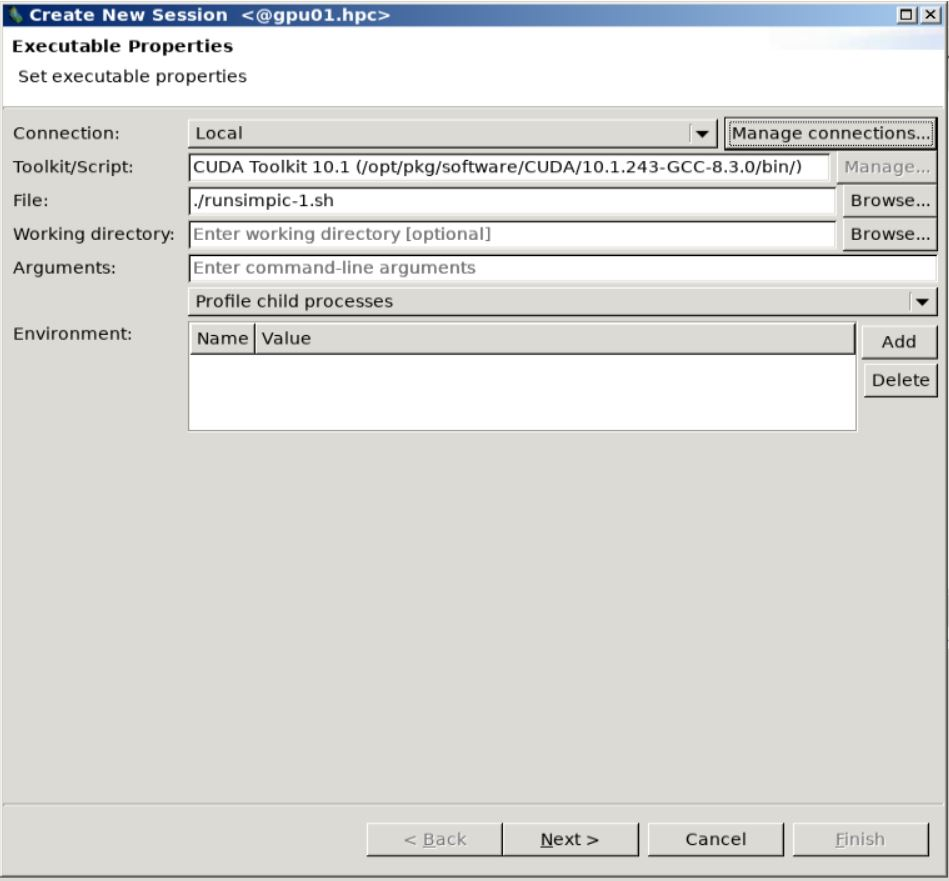

  Visualization step 1.

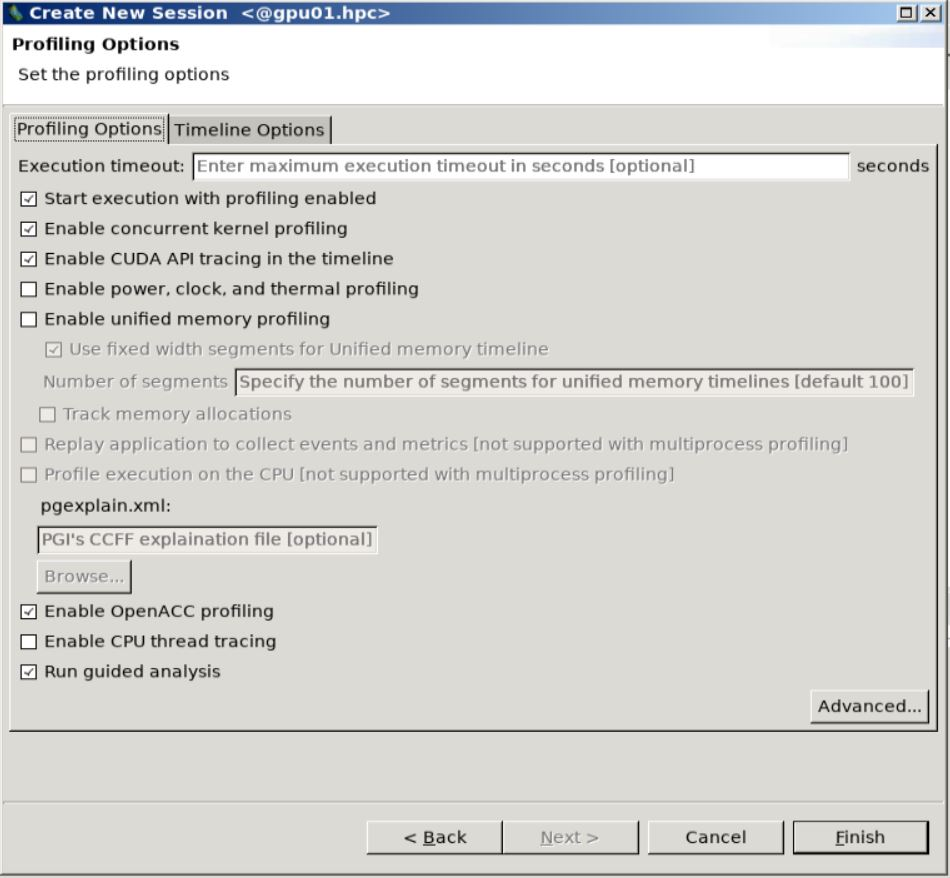

  Visualization step 2.

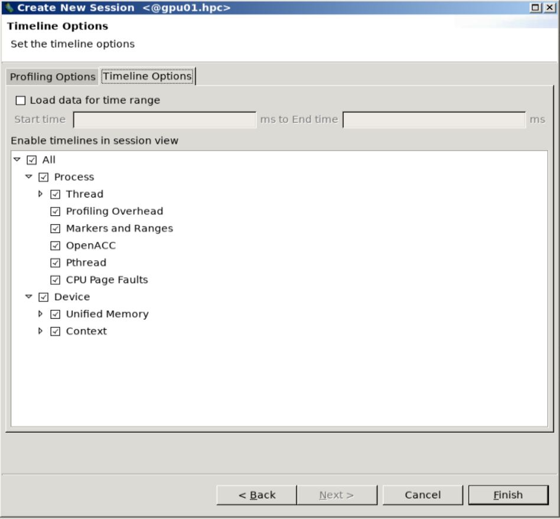

  Visualization step 3.

The visual profiler then runs the application and generates a visual
timeline of our code.

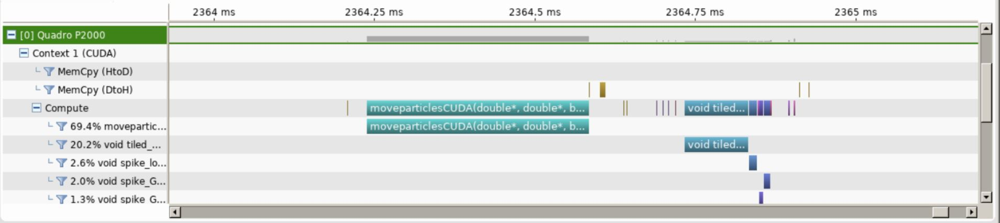

  Timeline of One Time Step of our full SIMPIC GPU version.

Some observations from the timeline in the figure from above:

#. We can see very minimal data transfers between the host and device. This justifies ouroptimized data transfer algorithm.

#. We see that the particle mover accounts for close to 70% of the compute time whereasthe remaining compute time is taken by thecuSparsematrix solver for fields.

#. This shows that we have been able to incorporate the two main computationally in-tensive parts of a Particle in Cell code in GPU.

Further Profiling Analysis on NVIDIA Profiler
---------------------------------------------

There are many more options we can use to further analyse our CUDA
kernels in detail in the NVIDIA Visual Profiler. We can explore them
now.

1. In the bottom left corner of the profiler you can see the
   ``CUDA Application Analysis`` tab.

   We can examine the GPU usage in our application by clicking on the
   ``Examine GPU Usage`` button here. We can also see the underlying numbers behind these results by clicking on each of these messages. You will be able to see these
   properties on the lower right hand corner of the profiler.

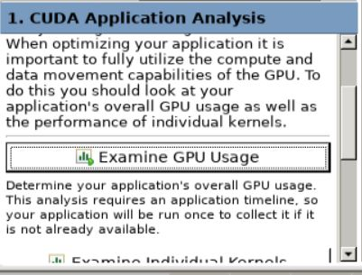

  GPU Usage button here. For our code we get the following results.
  
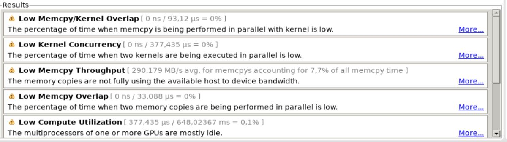

  Available profiling results.

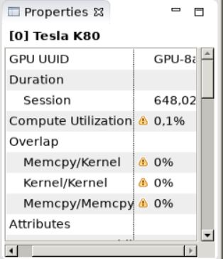

  All these numbers suggest there is lot of scope for further optimization of our kernel like concurrency of memory transfers and computation or multiple kernels and using multiple streaming multiprocessors (SM). It also indicates that our data size is actually much small that we are not using the full memory bandwidth of the PCIe link between the host and device.

2. You can see a new analysis tab ``Performance Critical Kernels`` on
   bottom left corner now. We can examine the performance of the
   individual CUDA kernels here by clicking on the
   ``Perform Kernel Analysis`` tab. You can then select the ``moveparticlesCUDA`` kernel to examine it.

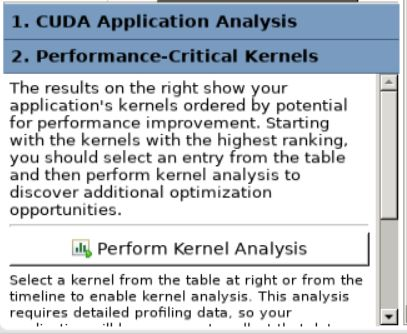
  
  Perform kernel analyisis panel.
  
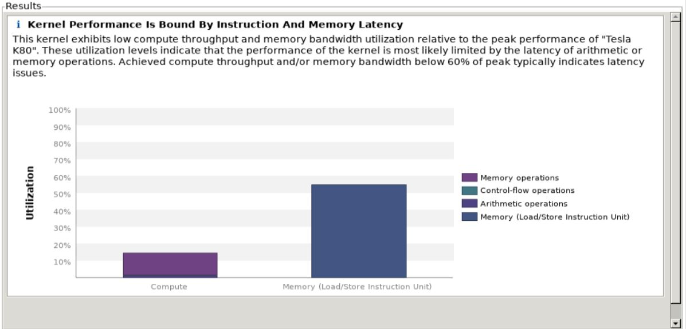
  
  We can see that our computation and memory transfer utilization is \textbf{low} when compared to the peak utilization of the our NVIDIA Tesla K80 accelerator. This means that latency dominates the runtime, indicating that to offload the particle mover to the GPU would make sense only for  much larger problem size. 

3. On the bottom left hand you can see a new
   analysis tab ``Compute,Bandwidth or Latency Bound``. You can analyse
   here if the performance of our kernel is limited by the computation,
   memory bandwidth or latency. These are 3 factors which generally
   limit the performance of any CUDA kernel. We first perform latency
   analysis by clicking on the ``Perform Latency Analysis`` tab. 

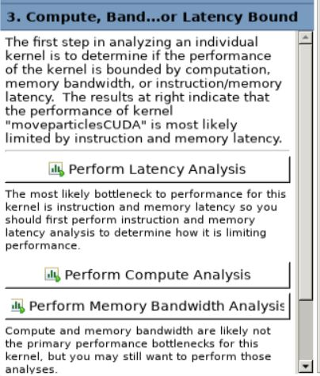
  
  Compute, bandwidth or Latency panel.
  
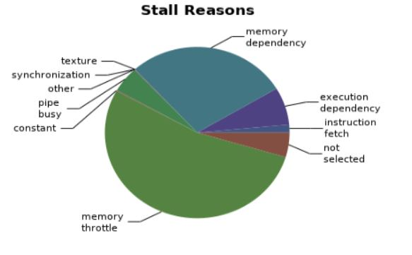
  
  We obtain this results. We can see that most of the latency issues arise from 'Memory Throttle' and 'Memory Dependencies'. I believe that this arises from the atomicAdd function in the weightparticlesCUDA. Memory throttle and dependency arises when a lot of pending memory operations stall the progress of the application. This happens in the case of access to the density array elements. We can maybe use a better parallel algorithm for the computation of density arrays.

4. We can now analyse the computation part of our CUDA kernel by
   clicking on the ``Perform Compute Analysis`` tab in the bottom left
   corner. We also get an analysis of what kind of data operations are happening in
   our kernel here. 

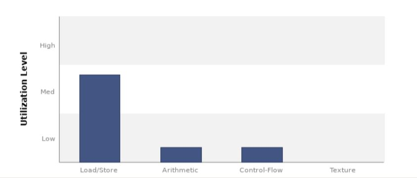
  
  We can see here that memory load/store operations are higher than arithmetic operations, hence indicating a memory bound kernel. We also get an analysis of what kind of data operations are happening in our kernel.

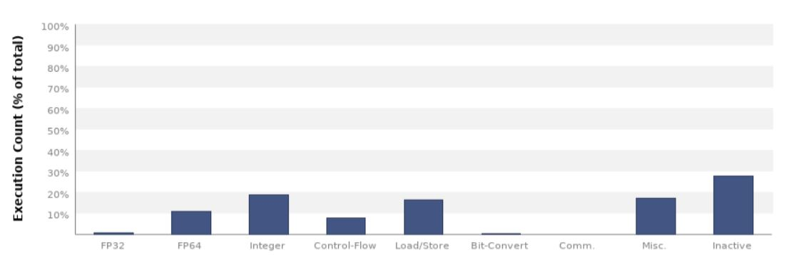
  
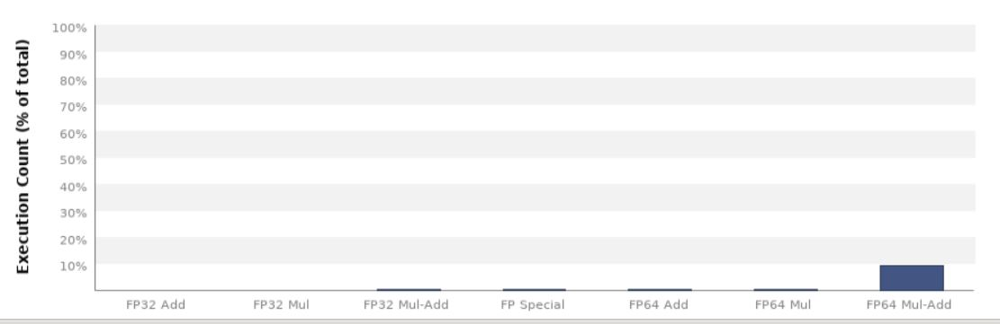
  
  We can see here that most of the arithmetic operations are double (FP64) fused multiply-add (FMA) operations, which is to be expected from our algorithm.

5. We can also analyse the usage of the different memory hierarchies in
   the GPU by clicking on the ``Perform Memory Bandwidth Analysis`` tab.

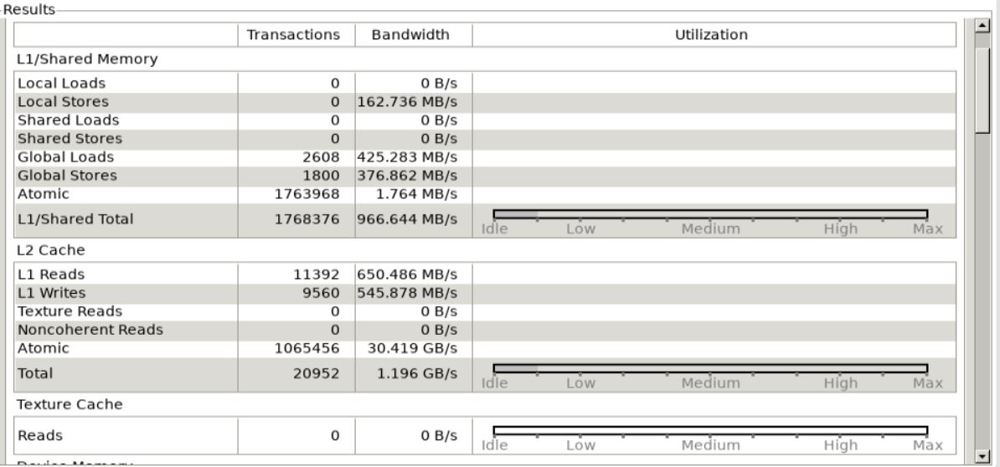
  
We can see that there is a lot of free memory in the GPU indicating that we are not using the full memory bandwidth of the GPU. This indicates that memory bandwidth is not likely to be the cause of any performance reduction.

Hence, we can conclude that the NVIDIA Visual Profiler has analysed our
kernel and given us many tips on how we can further optimise the code to
run on GPUs.

StarPU Version
~~~~~~~~~~~~~~~~

We used an external tracing application ``FxT`` for tracing purposes.
The resulting trace was visualised using the ``ViTE`` visualization
program. The required libraries are available only on the
``Bison machine`` only.

Installing FxT Library on Bison
-------------------------------

We need to install the FxT tracing library externally. You can follow
these steps to install it on the Bison machine.

.. code-block:: bash

   $ module load cuda-10.1.243-gcc-8.3.0-qpdenfa
   $ module load openmpi-3.1.4-gcc-8.3.0-hxcgcwk
   $ module load cmake-3.15.4-gcc-8.3.0-i7l4zh2
   $ module load help2man-1.47.11-gcc-8.3.0-ggupyzs

Building fxt:

.. code-block:: bash

   $ wget http://download.savannah.nongnu.org/releases/fkt/fxt-0.3.11.tar.gz
   $ tar xvf fxt-0.3.11.tar.gz
   $ cd fxt-0.3.11
   $ mkdir build
   $ cd build
   $ ../configure --prefix=$HOME/fxt
   $ make
   $ make install

Now we have installed FxT, we need to integrate this into our StarPU
library. For this, we need to configure StarPU with FxT. This can be
done by:

.. code-block:: bash

   $ cd starpu-1.3.4
   $ mkdir build
   $ cd build
   $ ../configure --prefix=$HOME/starpu --with-fxt=$HOME/fxt
   $ make
   $ make install
   $ export PKG_CONFIG_PATH=$PKG_CONFIG_PATH:$HOME/starpu/lib/pkgconfig
   $ export LD_LIBRARY_PATH=$HOME/starpu/lib:$LD_LIBRARY_PATH
   $ export PATH=$PATH:$HOME/starpu/bin

Installing ViTE Visualizer on Bison
-----------------------------------

We can now run our StarPU application with FxT library to perform
tracing. Now we need to install ViTE program in Bison to visualize the
trace file. This can be done by

.. code-block:: bash

   module load gcc-8.3.0-gcc-4.8.5-eodqjge    
   module load cmake-3.17.1-gcc-4.8.5-w7yrxtc
   module load qt-5.14.2-gcc-8.3.0-pk5i2vx
   git clone https://gitlab.inria.fr/solverstack/vite.git
   cd vite
   mkdir build
   cd build
   cmake -DCMAKE_INSTALL_PREFIX=$HOME/opt/vite ..
   make -j6
   make install

Now we have installed the required programs for profiling our StarPU
application.

Tracing and Profiling our SIMPIC StarPU version
-----------------------------------------------

Before tracing, please note that you should run the application for
**only one time step** for the current code version. Otherwise, it will
give a task dependency error. Since our application is a sequential one,
this is fine and will give us the same results anyways. To run our
application with tracing, you need to insert this in the command line:

.. code-block:: bash

   $ STARPU_SCHED=dmdas ./runsimpic.sh

This command runs the application and generates a trace file which is
stored in the ``tmp`` directory. The file is saved as
``prof-file-username-00``. Now we can execute the trace by first copying
it to our Home directory and then opening the visualizer. You can use
the following commands:

.. code-block:: bash

   cp \tmp\prof_file_{username}_00 $HOME
   cd $HOME/starpu
   $ ./bin/starpu_fxt_tool -i $HOME/prof_file_{username}_0

You will now be able to see the a fresh ``paje.trace`` file in the
``HOME/starpu`` directory.

You can now open the ViTE visualizer using:

.. code-block:: bash

   ~/opt/vite/bin/vite paje.trace

You can now see the profiling timeline for our application.

Examining the Profile
---------------------

You can now see the profiling timeline for our application in Figure below. Some observations from the figure.

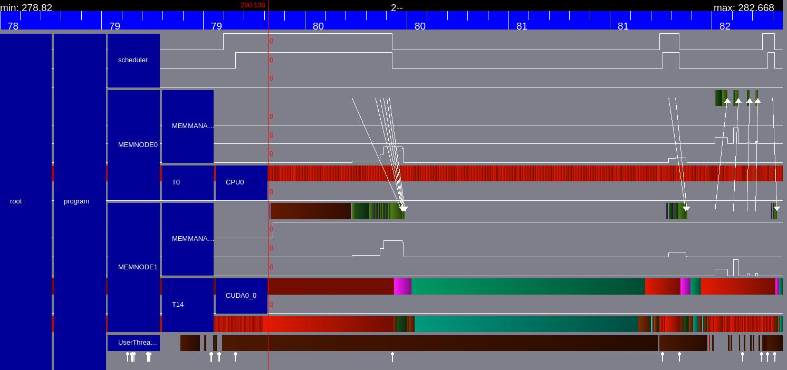

  Timeline for StarPU particle mover task.
  
#. We can see explicitly the memory transfers from the CPU memory to the CUDA memory as the white arrows.
#. The green bars indicate the StarPU tasks. The first task is the GPU particle mover task and the smaller green bar later is the field solver GPU task. The red parts indicate that the PU is idle.
#. Note that there are no explicit memory transfer calls in our code. All the required memory transfers are transferred by teh StarPU memory management and Scheduler by itself.
#. The timeline looks very similar to our GPU version. This is to be expected as this is essentially the same code but the kernels are executed as StarPU tasks.

Miscellaneous
=============

General CUDA-GPU guidelines
~~~~~~~~~~~~~~~~~~~~~~~~~~~

In this section we want to share some general guidelines and tips for
moving existing codes to CUDA.

Almost every program must have:

#. Obviously it is needed `a CUDA
   GPU <https://developer.nvidia.com/cuda-gpus>`__ and `CUDA
   software <https://developer.nvidia.com/cuda-toolkit>`__ installed.

#. Use a CUDA extension on your file ``.cu`` and compile with C++ CUDA
   compiler ``nvcc`` .

#. Including basic CUDA libraries such as ``cuda.h``, ``cuda_runtime.h``
   and ``device_launch_parameters.h``.

#. ``cudaSetDevice`` is a must have for a CUDA program to run.

#. Correctly allocate data in GPU (``cudaMalloc``) before any
   computation is made. Also copy and set memory from CPU to GPU and
   viceversa when needed using ``cudaMemcpy`` and ``cudaMemcpy``. If
   this is done incorrectly memory errors may or not raise. You can also
   execute your code with the CUDA memory checker to get more
   information about bad memory errors. In our case executing in command
   line: ``cuda-memcheck ./runsimpic.sh`` .

#. It is also important to deallocate data when the program finishes
   using ``cudaFree``.

#. CUDA kernel calls are made with the spetial semantics:
   ``cudaFunction<<<NBlocks, NThreads>>>(args);``

Some tips:

-  You can add **flags to the CUDA compiler** to add libraries and
   features such as ``-lmpi`` (compiles with MPI) and ``-lcusparse``
   (compiles with the cuSPARSE libraries).

-  CUDA has some useful **libraries** that can be added to ease our
   work. Checking the `CUDA
   libraries <https://docs.nvidia.com/cuda-libraries/index.html>`__ is
   always a good option.

-  Try to **avoid global data** in GPU kernels, in case it is not
   posible use functions such as ``atomicAdd``. `Shared
   data <https://developer.nvidia.com/blog/using-shared-memory-cuda-cc/>`__
   is the fastest way to access data in CUDA but not always the best
   option.

-  Operations in different threads should be completely **independent**.

-  **for loops** with indepent calculations are easy to parallelize.
   Each thread might do the calculation for one index.

-  **Avoid copying data from GPU to CPU** and viceversa as it slows the
   program.

-  **Track timings** of the program to find extra/bad calls or
   computations.

-  Move to GPU function by function and compare with the original CPU
   program results (obvious).
